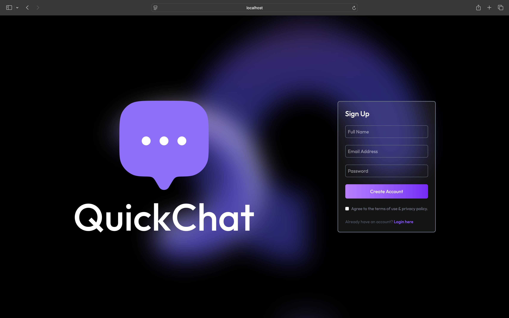
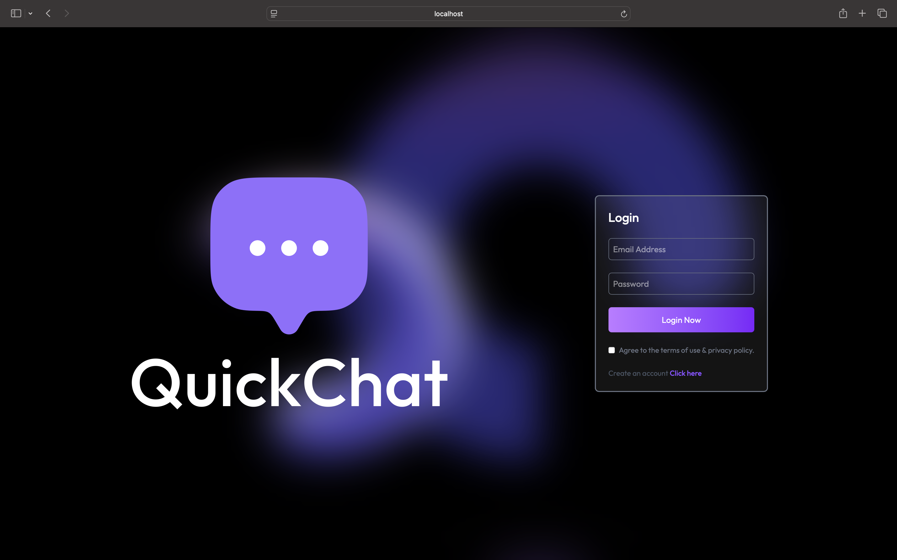
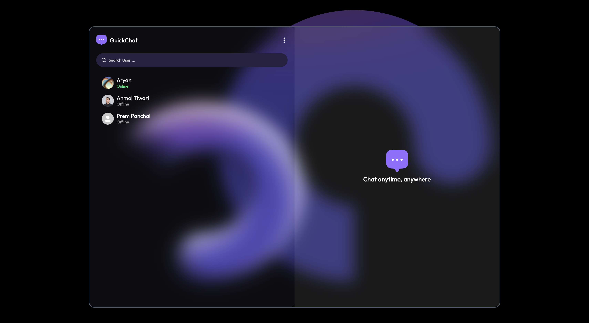
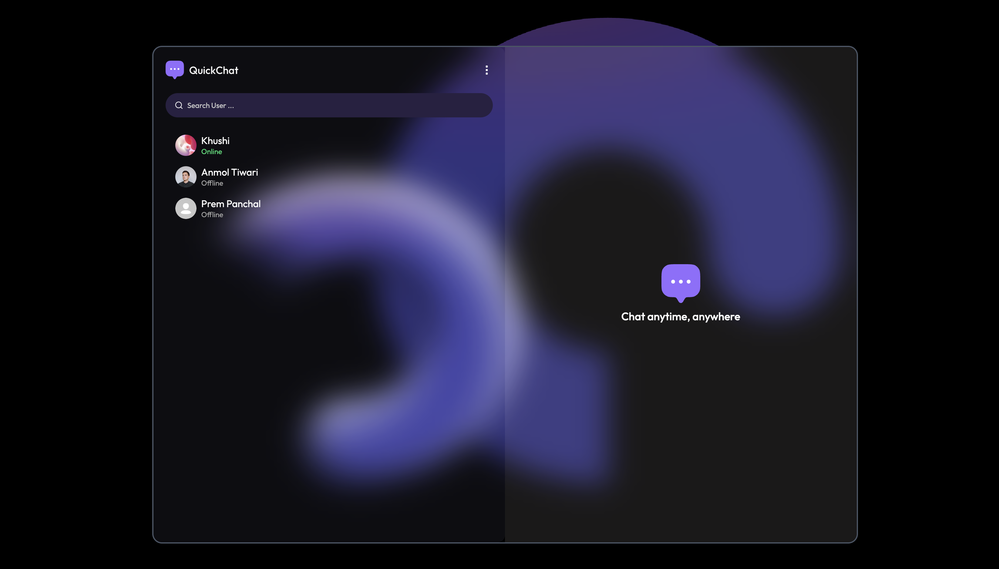
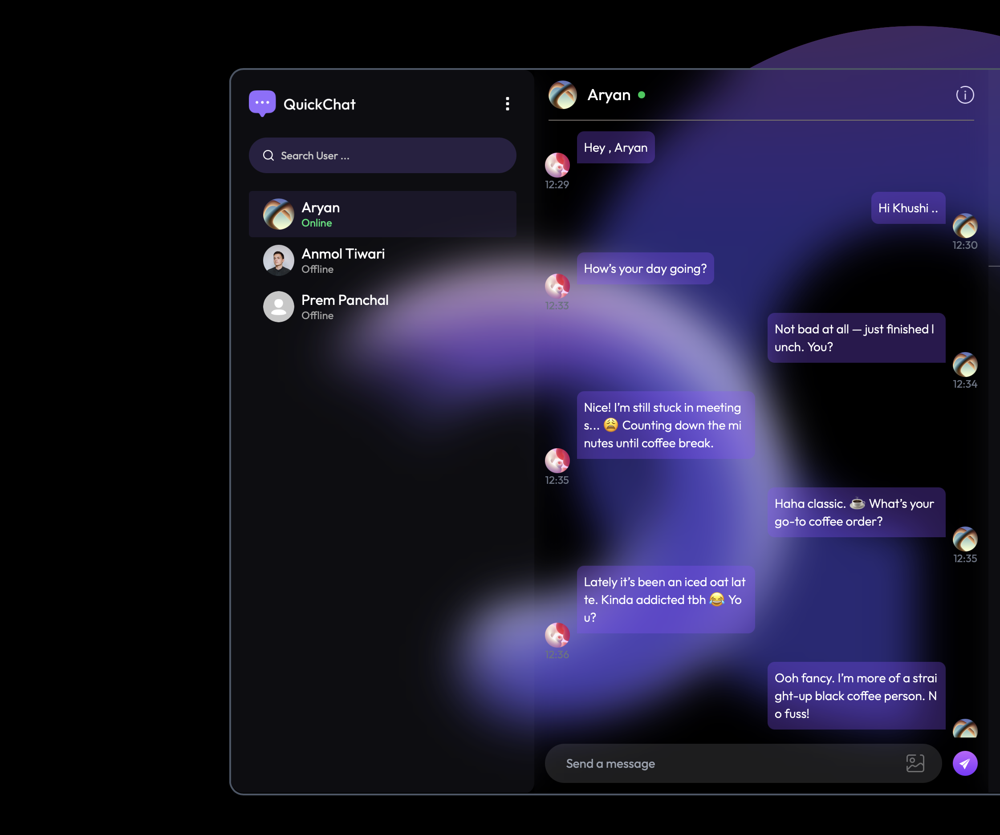
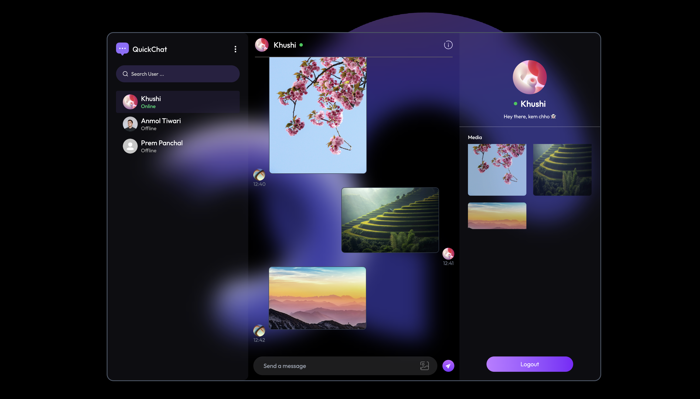
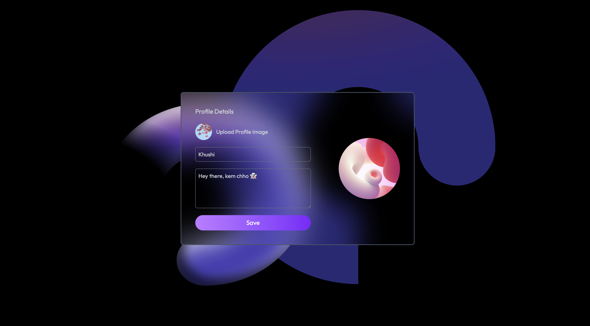

# Whispr - Real-Time Chat App

Whispr is a full-stack real-time chat application built with React, Node.js, Express, MongoDB, and Socket.IO.  
It supports instant messaging, online user status, profile management, and media sharing.

## Features

- Real-time messaging with Socket.IO
- Online/offline user status
- Profile editing and avatar upload
- Media/image sharing in chat
- Responsive UI with Tailwind CSS
- Authentication (Sign Up / Login)
- Unseen message notifications


## Folder Structure

```
client/
  context/            # Handles authentication state and logic and Manages chat state, users, and messages
  src/
    components/      # Reusable UI components (Sidebar, ChatBox, etc.)
    pages/           # Main app pages (Login, Signup, Profile, Home)
    assets/          # Images, icons, and other static assets
  public/             # Static files served by frontend (index.html, screenshots)
server/
  controllers/        # Route handler functions (user, message logic)
  models/             # Mongoose schemas for User and Message
  routes/             # Express route definitions (API endpoints)
  middleware/         # Custom Express middleware (auth, error handling)
  lib/                # Utility files (DB connection, Cloudinary config)
```

## Technologies Used

- React
- Vite
- Tailwind CSS
- Socket.IO
- Express
- MongoDB & Mongoose
- Cloudinary

## Screenshots
### SignUp Page

### Login Page

### First User Sidebar

### Second User Page

### Chat

### Chat with Images

### Edit Profile / Update Profile


## Getting Started

### Prerequisites

- Node.js & npm
- MongoDB (local or Atlas)
- Cloudinary account (for image uploads)

### Installation

1. **Clone the repository:**
    ```bash
    git clone https://github.com/AryanP107/Whispr.git
    cd Whispr
    ```

2. **Setup environment variables:**
    - Create `.env` in both `/client` and `/server` folders.
    - Fill in your MongoDB URI, JWT secret, and Cloudinary credentials.

3. **Install dependencies:**
    ```bash
    cd server
    npm install
    cd ../client
    npm install
    ```

4. **Run the app:**
    - Start the backend:
        ```bash
        cd server
        npm run server
        ```
    - Start the frontend:
        ```bash
        cd ../client
        npm run dev
        ```

5. **Open in browser:**
    ```
    http://localhost:5173
    ```


## Contributions

Feel free to fork this repository and contribute! You can help by:

- Reporting bugs.
- Improving the design or UX.
- Adding additional features if needed.

## Author

Aryan Panchal

GitHub: [AryanP107](https://github.com/AryanP107)  
Email: aryanpanchal107@gmail.com

## Contact

If you have any questions or suggestions, feel free to open an issue or contact me at [aryanpanchal07@gmail.com](mailto:aryanpanchal07@gmail.com).